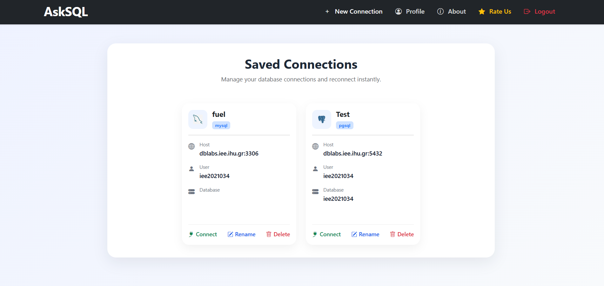
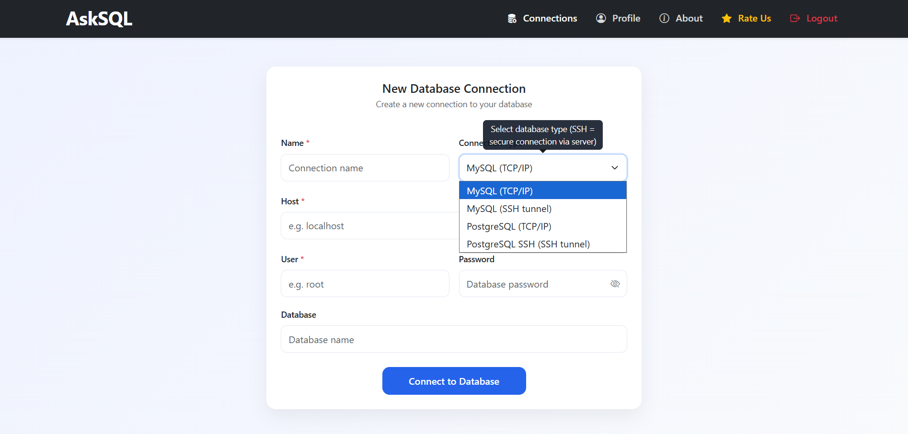
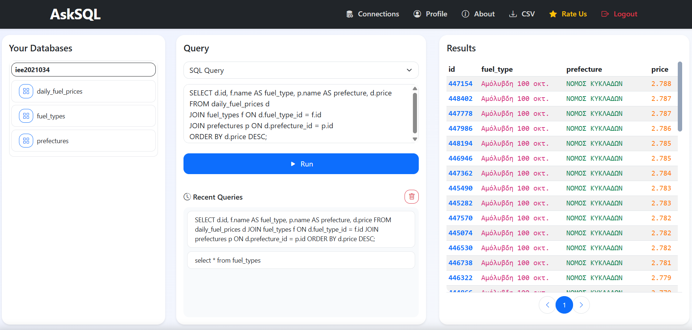
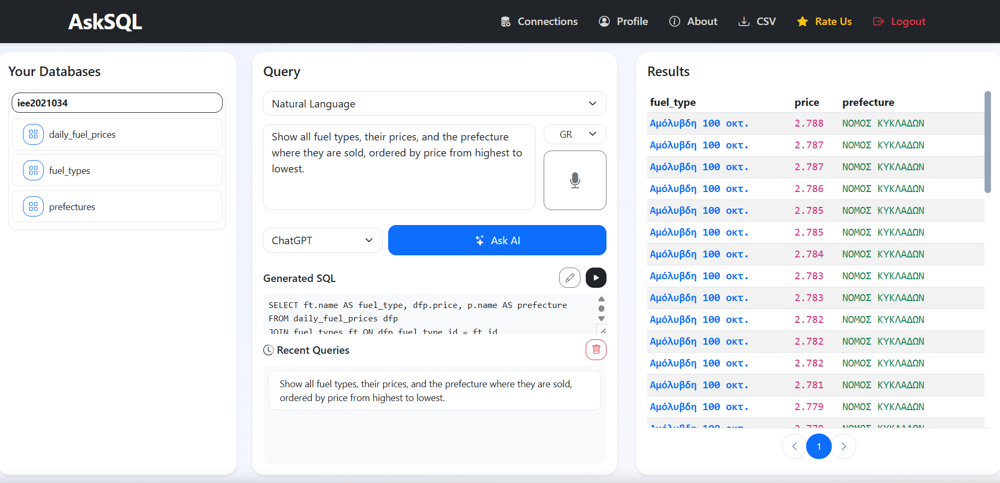

# AskSQL

AskSQL is an open-source web application that enables users to interact with relational databases using both traditional SQL queries and natural language.

The application uses Large Language Models (LLMs) to convert natural language questions into SQL queries, making database querying more accessible to users with limited SQL knowledge.

---

## Features

- Natural Language to SQL conversion using AI models
- Direct SQL query execution
- Support for multiple LLM providers
- MySQL and PostgreSQL support
- TCP/IP and SSH tunnel connections
- Database schema and table exploration
- Generated SQL preview
- Saved connections and query history
- CSV export of query results
- Voice-to-text input for natural language queries
- User authentication and account management
- Role-based access control

---

# User Interface

## Saved Connections

Users can save and manage database connections and reconnect to them quickly.



## New Database Connection

AskSQL supports MySQL and PostgreSQL connections through TCP/IP and SSH tunneling.



## SQL Query Mode

Users can write and execute SQL queries directly and view the results in an interactive table.



## Natural Language Query Mode

Users can ask questions in natural language. The selected AI model generates the corresponding SQL query, which can be reviewed and executed.



Example:

> Show all fuel types, their prices, and the prefecture where they are sold, ordered by price from highest to lowest.

---

# Technologies

### Backend

- PHP 8.x
- PDO
- MySQL
- PostgreSQL

### Frontend

- HTML5
- CSS3
- JavaScript
- Bootstrap 5

### AI Integration

- OpenAI
- DeepSeek

### Additional Tools

- Composer
- PHPMailer
- Google OAuth
- SSH utilities
- `mysqldump`
- `pg_dump`

---

# Requirements

Before installing AskSQL, make sure your environment includes:

- PHP 8.x or later
- Composer
- MySQL and/or PostgreSQL
- PDO extensions for MySQL and PostgreSQL
- A web server such as Apache or Nginx
- SSH utilities for SSH tunnel connections
- `mysqldump` for MySQL schema extraction
- `pg_dump` for PostgreSQL schema extraction

Depending on the enabled features, API credentials for AI providers, SMTP, and Google OAuth may also be required.


# Installation

## 1. Clone the repository

Clone the repository to your local machine or server:

```bash
git clone https://github.com/margaritadeligianni/AskSQL.git
cd AskSQL
```

---

## 2. Install dependencies

Install the required PHP dependencies using Composer:

```bash
composer install
```

---

## 3. Create the application database

Create a MySQL database for the AskSQL application:

```sql
CREATE DATABASE asksql;
```

Then import the provided database schema located at:   `database/database_schema.sql`


Example:

```bash
mysql -u your_username -p asksql < database/database_schema.sql

---

## 4. Configure the environment

Create a `.env` file based on the provided `.env.example` file:

```bash
cp .env.example .env
```

On Windows, you can manually copy and rename:

```text
.env.example
```

to:

```text
.env
```

Then configure the required environment variables.

Example:

```env
DB_HOST=localhost
DB_NAME=asksql
DB_USER=your_database_user
DB_PASS=your_database_password
```

Depending on the features you want to use, you may also need to configure:

- OpenAI API key
- DeepSeek API key
- SMTP settings for email functionality
- Google OAuth credentials
- Application URL and other environment-specific settings

---

## 5. Configure your web server

Configure a web server such as Apache to serve the application.

Make sure that:

- PHP is enabled and properly configured.
- The required PHP extensions are installed.
- MySQL and/or PostgreSQL support is enabled.
- Required utilities such as `mysqldump` and `pg_dump` are available if schema extraction is used.


---
